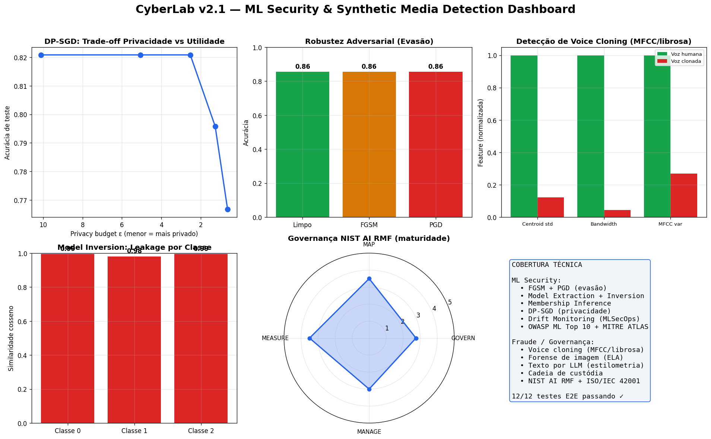

<h1 align="center">🛡️ CyberLab</h1>
<p align="center">
  <strong>Laboratório de Segurança Ofensiva, Defensiva e de Machine Learning</strong><br>
  Do pentest clássico ao Adversarial ML e à detecção de fraude por IA generativa
</p>

<p align="center">
  
  
  
  
</p>

---

## 📌 Visão Geral

**CyberLab** é um laboratório educacional que cobre o ciclo completo de segurança — **ataque, defesa, análise e governança** — em **duas frentes**:

| Frente | Conteúdo | Status |
|--------|----------|--------|
| 🔓 **Segurança Clássica** (v1.0) | Reconhecimento, brute force, malware simulado, hardening | ✅ |
| 🤖 **ML Security & IA Generativa** (v2.x) | Adversarial ML, MLSecOps, deepfake/voice/text detection, governança | ✅ |

Todo o código é **executável e testado de ponta a ponta** (`20/20` testes E2E passando). Os ataques e defesas de ML são implementados **do zero em NumPy/scikit-learn** — sem caixas-pretas — para deixar cada técnica transparente e auditável.

> ⚠️ **Uso educacional.** Toda execução ocorre em ambiente isolado, com dados sintéticos ou VMs Host-Only. Nenhum sistema real é alvo.

---

## 🎯 Por que este projeto existe

A superfície de ataque mudou. Hoje o alvo não é só a rede — é **o modelo de ML que decide crédito, fraude e malware**, e o **conteúdo sintético** (deepfake, voz clonada, phishing por LLM) que quebra a verificação tradicional. Casos como o **deepfake da Arup (US$ 25 milhões)** e o **vishing com voz clonada na LastPass** mostram que controles clássicos não seguram esse vetor.

CyberLab v2 demonstra, na prática, **como esses ataques funcionam e como defender** — cobrindo os requisitos técnicos de vagas sênior de **ML Security** e **Prevenção a Fraude / Governança de Risco de IA**.

📖 A narrativa completa está em [`docs/06_storytelling_v2.md`](docs/06_storytelling_v2.md).

---

## 🧩 Capacidades Técnicas

### 🤖 ML Security (Adversarial ML)

| Técnica | Módulo | O que faz |
|---------|--------|-----------|
| **Data Poisoning** | [`poisoning_attacks.py`](scripts/python/ml_security/poisoning_attacks.py) | Label flipping (indiscriminado/direcionado), backdoor/trojan |
| **Clean-Label Poisoning** | [`clean_label_poisoning.py`](scripts/python/ml_security/clean_label_poisoning.py) | **Feature collision** (Poison Frogs) — poison com rótulo correto que flipa o alvo |
| **Evasão FGSM + PGD** | [`adversarial_attacks.py`](scripts/python/ml_security/adversarial_attacks.py) | Exemplos adversariais white-box + ataque black-box por queries |
| **Transferability + Benchmark** | [`adversarial_transferability.py`](scripts/python/ml_security/adversarial_transferability.py) | Transferência entre modelos + curva de robustez + **gradient masking** |
| **Defesa Adversarial** | [`adversarial_defense.py`](scripts/python/ml_security/adversarial_defense.py) | Adversarial training, defensive distillation, detecção de anomalia, ensemble |
| **Watermarking + Activation Clustering** | [`model_watermarking.py`](scripts/python/ml_security/model_watermarking.py) | Prova de propriedade (anti-extração) + detecção de poisoning por clustering |
| **Model Extraction** | [`model_extraction.py`](scripts/python/ml_security/model_extraction.py) | Clonagem de modelo via API + membership inference |
| **Model Inversion** | [`model_inversion.py`](scripts/python/ml_security/model_inversion.py) | Reconstrução de dado de treino (privacy leakage) |
| **Differential Privacy** | [`differential_privacy.py`](scripts/python/ml_security/differential_privacy.py) | **DP-SGD do zero** com clipping + ruído; mede trade-off ε vs utilidade |
| **MLSecOps** | [`mlsecops_monitoring.py`](scripts/python/ml_security/mlsecops_monitoring.py) | Drift detection, malicious drift, audit log, incident response |

### 🎭 Detecção de Mídia Sintética & Forense

| Técnica | Módulo | O que faz |
|---------|--------|-----------|
| **Voice Cloning (features)** | [`audio_detector.py`](scripts/python/synthetic_media/audio_detector.py) | **MFCC/librosa reais** — centroid, bandwidth, ZCR discriminam voz sintética |
| **Anti-Spoofing (classificador)** | [`antispoofing.py`](scripts/python/synthetic_media/antispoofing.py) | Classificador **estilo ASVspoof** treinado em MFCC + **callback verification** |
| **Deepfake de Vídeo** | [`deepfake_video.py`](scripts/python/synthetic_media/deepfake_video.py) | Análise **temporal** (eye-blink, flicker) + proveniência **C2PA** |
| **Forense de Imagem** | [`image_forensics.py`](scripts/python/synthetic_media/image_forensics.py) | **ELA (Error Level Analysis)** localizado + análise de ruído + EXIF |
| **Phishing por IA** | [`phishing_detector.py`](scripts/python/synthetic_media/phishing_detector.py) | **Burstiness**, typosquatting/homoglyph de URL, **LLM-as-judge** |
| **Texto por LLM** | [`text_detector.py`](scripts/python/synthetic_media/text_detector.py) | Perplexidade, estilometria, padrões típicos de LLM |
| **Cadeia de Custódia** | [`forensic_evidence.py`](scripts/python/synthetic_media/forensic_evidence.py) | Chain of custody, hash SHA-256, laudo forense defensável |

### ⚖️ Governança de Risco de IA

| Framework | Módulo | O que faz |
|-----------|--------|-----------|
| **NIST AI RMF + ISO/IEC 42001** | [`ai_risk_assessment.py`](scripts/python/governance/ai_risk_assessment.py) | Assessment executável de maturidade + relatório priorizado |
| **Controles Antifraude + EU AI Act** | [`antifraud_controls.py`](scripts/python/governance/antifraud_controls.py) | Dupla autorização, hold bancário, callback + classificação de risco EU AI Act |

### 🔓 Segurança Clássica (v1.0)

Reconhecimento (Nmap) · Brute force (FTP/SMB/DVWA) · Ransomware & keylogger simulados · Análise de logs · Hardening & validação.

---

## 📊 Dashboard

Painel visual consolidado gerado por [`scripts/generate_dashboard.py`](scripts/generate_dashboard.py):



*Trade-off de privacidade DP-SGD · Robustez adversarial · Detecção de voz clonada · Model inversion · Maturidade de governança.*

---

## 🗺️ Frameworks de Referência

| Framework | Aplicação no projeto |
|-----------|----------------------|
| **MITRE ATLAS** | Threat modeling do pipeline de ML — [`docs/04`](docs/04_ml_security_threat_model.md) |
| **OWASP ML Security Top 10** | Matriz de riscos implementados — [`docs/07`](docs/07_owasp_ml_security_top10.md) |
| **NIST AI RMF 1.0** | Assessment de governança (GOVERN/MAP/MEASURE/MANAGE) |
| **ISO/IEC 42001** | Controles de AI Management System |
| **EU AI Act** | Classificação de risco (proibido/alto/limitado/mínimo) — [`antifraud_controls.py`](scripts/python/governance/antifraud_controls.py) |

---

## 🚀 Quickstart

```bash
# 1. Instalar dependências (testado em Python 3.10)
pip install -r requirements.txt

# 2. Rodar a suite de testes end-to-end (20 testes)
python scripts/test_e2e_ml_security.py

# 3. Gerar o dashboard visual
python scripts/generate_dashboard.py

# 4. Rodar um módulo isolado (cada um tem demo standalone)
python scripts/python/ml_security/differential_privacy.py
python scripts/python/synthetic_media/audio_detector.py
python scripts/python/governance/ai_risk_assessment.py
```

Cada módulo roda **standalone** e gera resultados em `results/`.

---

## 📈 Resultados Reais (reproduzíveis)

```
DP-SGD Trade-off:        ε=8.99→acc=0.82  ...  ε=1.12→acc=0.82   (privacidade ↑, utilidade estável)
Model Inversion:         cos_sim=0.99 vs média real da classe    (HIGH leakage detectado)
Model Extraction:        97% de agreement com modelo-alvo         (clonagem bem-sucedida)
Voice Cloning:           natural=0.00 · sintético=1.00            (discriminação perfeita)
Image Forensics (ELA):   adulterada=0.70 · limpa=0.25             (splicing detectado)
Governança NIST AI RMF:  maturidade 3.0/5 (Definido)
```

---

## 📁 Estrutura

```
CyberLab/
├── scripts/
│   ├── python/
│   │   ├── ml_security/          # 7 módulos: poisoning, FGSM/PGD, defense,
│   │   │                         #   extraction, inversion, DP-SGD, MLSecOps
│   │   ├── synthetic_media/      # voz (MFCC), imagem (ELA), texto (LLM), forense
│   │   ├── governance/           # NIST AI RMF + ISO/IEC 42001
│   │   ├── scanner.py            # v1.0: Nmap
│   │   ├── brute_force.py        # v1.0: Medusa
│   │   ├── logs_analyzer.py      # v1.0: análise de logs
│   │   └── malware/              # v1.0: ransomware + keylogger simulados
│   ├── test_e2e_ml_security.py   # suite E2E (20 testes)
│   └── generate_dashboard.py     # dashboard visual
├── notebooks/                    # 10 notebooks do laboratório clássico
├── docs/                         # 7 documentos técnicos
├── results/                      # saídas geradas (JSON, PNG)
└── requirements.txt
```

---

## 📚 Documentação

| Doc | Conteúdo |
|-----|----------|
| [`01_metodologia.md`](docs/01_metodologia.md) | Ciclo de vida do laboratório clássico |
| [`02_ataques_detalhes.md`](docs/02_ataques_detalhes.md) | Detalhes técnicos dos ataques |
| [`03_defesa_estrategia.md`](docs/03_defesa_estrategia.md) | Defense in depth |
| [`04_ml_security_threat_model.md`](docs/04_ml_security_threat_model.md) | MITRE ATLAS aplicado a ML |
| [`05_synthetic_media_detection.md`](docs/05_synthetic_media_detection.md) | Deepfake, voice cloning, texto |
| [`06_storytelling_v2.md`](docs/06_storytelling_v2.md) | A motivação por trás da v2.0 |
| [`07_owasp_ml_security_top10.md`](docs/07_owasp_ml_security_top10.md) | Matriz OWASP ML Top 10 |

---

## 🧭 Roadmap

- **v2.1** ✅ ML Security completo (FGSM/PGD, extraction, inversion, DP-SGD, MLSecOps), voz/imagem forense, governança, dashboard, testes E2E
- **v2.2** ✅ Clean-label poisoning, transferability + gradient masking, watermarking + activation clustering, anti-spoofing (ASVspoof), deepfake de vídeo + C2PA, phishing (URL/LLM-as-judge), controles antifraude + EU AI Act — **20/20 testes**
- **v2.3** ⏳ Notebooks Jupyter por módulo · integração Evidently/whylogs · fine-tuning de detectores
- **v3.0** 🔮 Laboratório interativo com VMs · integração cloud

---

<p align="center">
  <em>CyberLab — projeto de portfólio em cibersegurança & ML Security</em><br>
  <strong>⚠️ Ambiente controlado. Fins estritamente educacionais.</strong>
</p>
